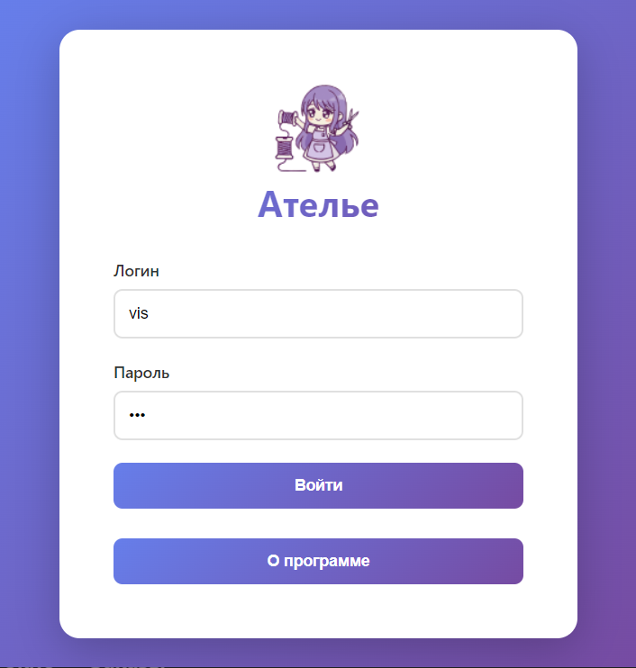
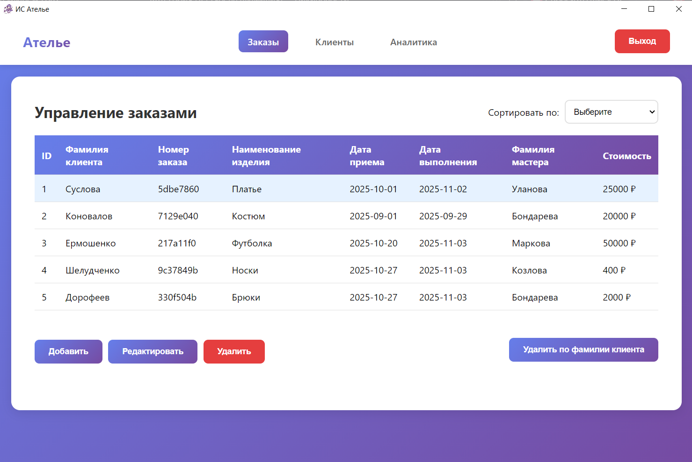
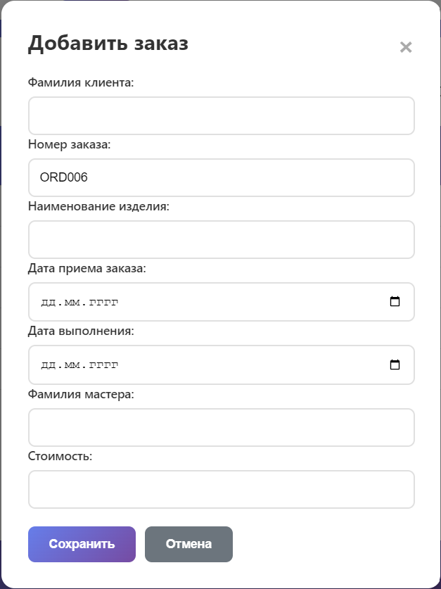
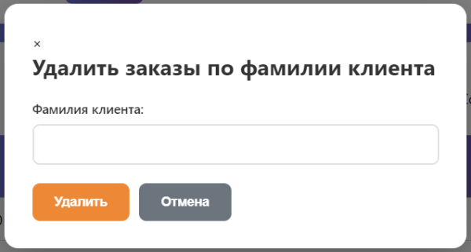
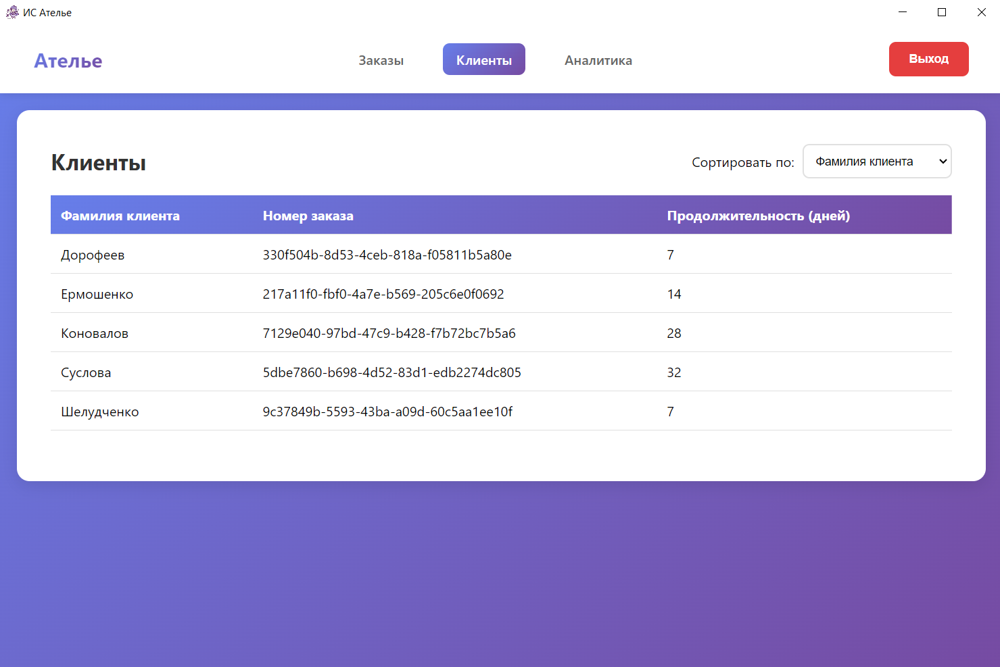
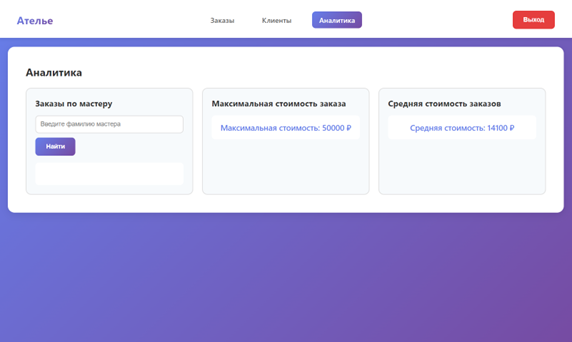
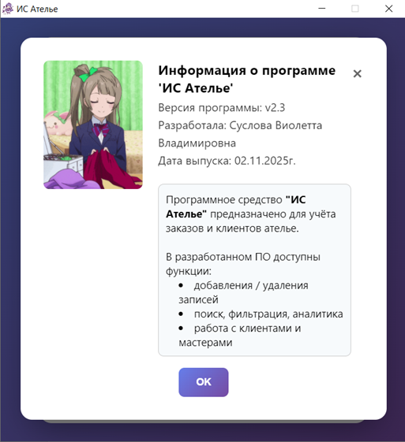

# ИС Ателье — система учёта заказов и клиентов

## Установка и запуск

1. Склонируйте или скачайте репозиторий.
2. Установите зависимости:
```npm install```
и запустите backend:
```python app.py```
3. Запустите frontend командой:
```npm start```

## Быстрый вход

- Логин ```vis```
- Пароль ```123```

## Описание основных функций

- Ведение заказов на пошив одежды
- База клиентов и мастеров
- Редактирование, удаление, поиск заказов
- Аналитика: максимальная и средняя стоимость, количество заказов по мастеру


## Инструкция по использованию

### Окно входа

Введите логин и пароль для доступа к системе.




### Главное окно — Заказы

Просматривайте, сортируйте и управляйте заказами.  
Добавление нового заказа — кнопка “Добавить”.




### Добавление/редактирование заказа

Вся информация обязательна: фамилия клиента, номер заказа (формируется автоматически), изделие, даты, мастер, стоимость.




### Удаление заказа/удаление по фамилии клиента

Для удаления выберите нужную запись или используйте кнопку “Удалить по фамилии клиента”.




### Вкладка “Клиенты”

Таблица всех клиентов, сортировка и быстрый поиск.




### Вкладка “Аналитика”

Количество заказов по мастеру, максимальная и средняя стоимость.




### Окно “О программе”

Справочная информация: версия, разработчик, назначение.




